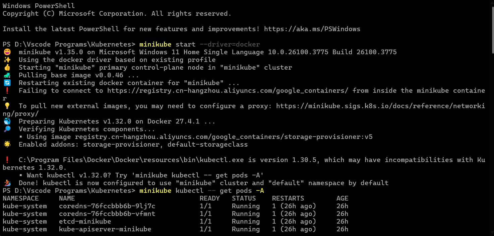
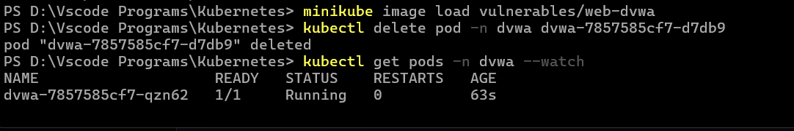
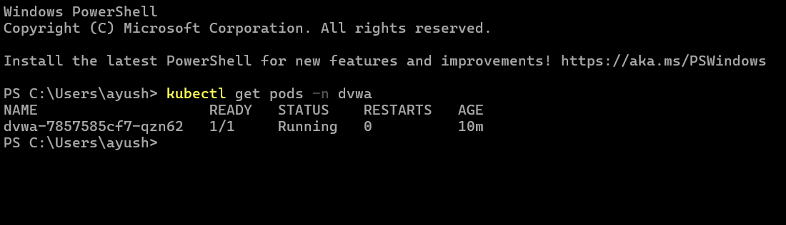
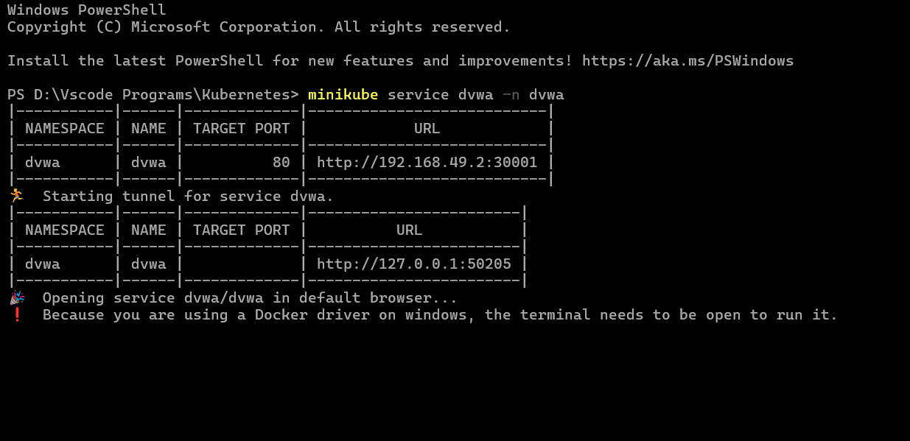
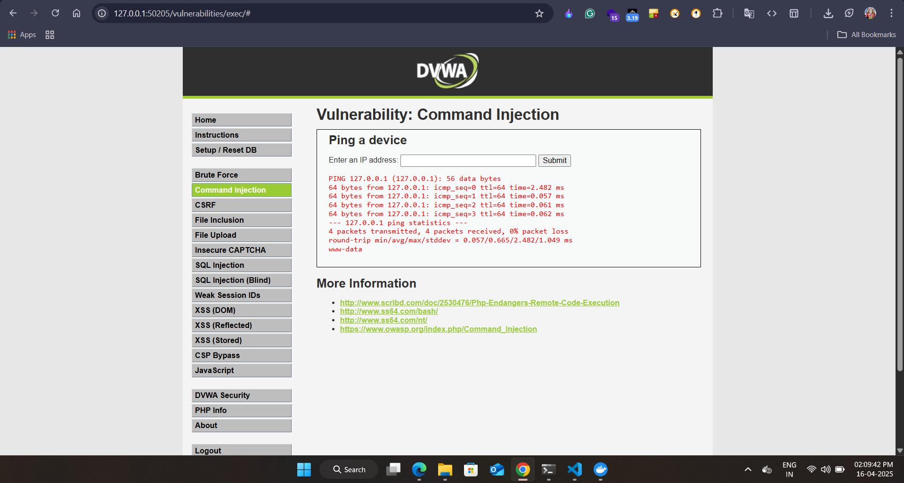
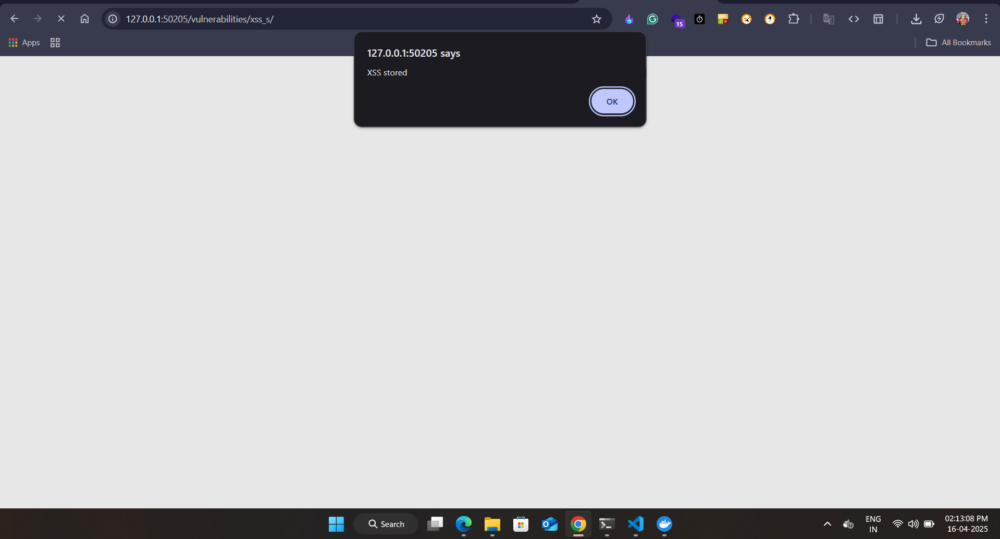
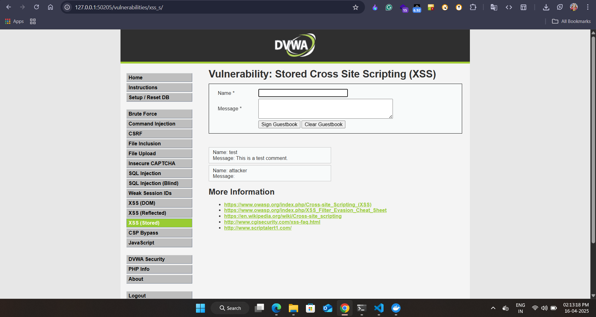

🛡️ DVWA on Kubernetes - Local Security Lab
===========================================

This project demonstrates how to deploy **Damn Vulnerable Web Application (DVWA)** on a local Kubernetes cluster using **Minikube** and then simulate common web application attacks.

📸 Screenshots
--------------

*   Minikube Running:
*   
*   
*   

*   DVWA Deployment: 
*   

*   Command Injection Result:
*   

*   SQL Injection Result:
*   

*   Stored XSS Alert:
*   
*   

🛠 Setup Steps
--------------

### 1\. Start Minikube

    minikube start --driver=docker

### 2\. Create `dvwa.yaml`

Save the following content into a file named `dvwa.yaml`:

    apiVersion: v1
    kind: Namespace
    metadata:
      name: dvwa
    
    ---
    apiVersion: v1
    kind: Service
    metadata:
      name: dvwa
      namespace: dvwa
    spec:
      type: NodePort
      selector:
        app: dvwa
      ports:
        - port: 80
          targetPort: 80
          nodePort: 30001
    
    ---
    apiVersion: apps/v1
    kind: Deployment
    metadata:
      name: dvwa
      namespace: dvwa
    spec:
      replicas: 1
      selector:
        matchLabels:
          app: dvwa
      template:
        metadata:
          labels:
            app: dvwa
        spec:
          containers:
            - name: dvwa
              image: vulnerables/web-dvwa
              ports:
                - containerPort: 80
    

### 3\. Apply the Configuration

    kubectl apply -f dvwa.yaml

### 4\. Access DVWA

    minikube service dvwa -n dvwa

Open the given URL (usually `http://192.168.49.2:30001`) in your browser.

### 5\. Login

*   Username: `admin`
*   Password: `password`

Go to **DVWA Security** tab and set security level to `LOW`.

🧪 Attack Demonstrations
------------------------

### 1️⃣ Command Injection

*   Go to: **DVWA → Command Injection**
*   Input: `127.0.0.1; whoami`
*   Result: Displays container user like `www-data`

### 2️⃣ SQL Injection

*   Go to: **DVWA → SQL Injection**
*   Input: `1' OR '1'='1`
*   Result: Database returns all users bypassing login filters

### 3️⃣ Stored Cross Site Scripting (XSS)

*   Go to: **DVWA → Stored XSS**
*   Input:
    
        
    
*   Result: Alert pops up when viewing the page

🧹 Cleanup
----------

To remove the deployment and stop the cluster:

    kubectl delete namespace dvwa
    minikube stop

📚 References
-------------

*   [DVWA GitHub](https://github.com/ethicalhack3r/DVWA)
*   [OWASP Attack References](https://owasp.org/www-community/attacks/)

* * *

Created for practicing security testing.

📌 Author
-------------
# Ayush Trivedi
